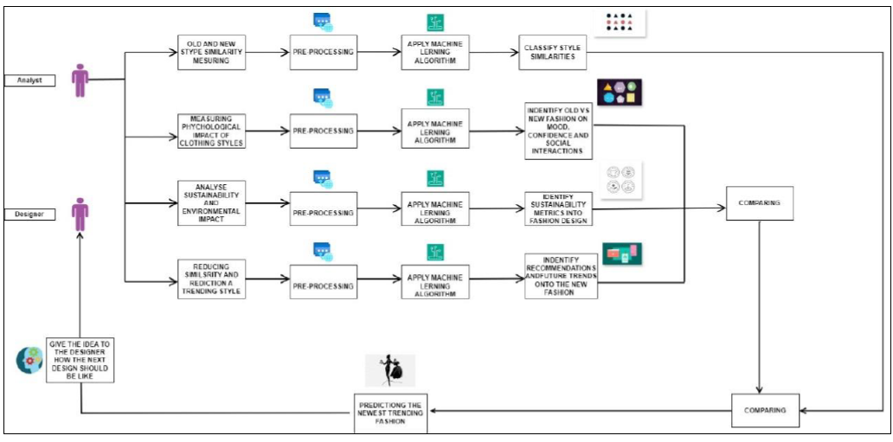

# Lululemon Active Wear 

## Overview: Global apparel tech combination offering end-to-end solutions for leading apparel brands.
Innovation: Anticipates future trends to push the boundaries of human potential.
Partnerships: Collaborates for groundbreaking progress in the apparel industry.
Sustainability: Committed to ethical and sustainable manufacturing, setting industry benchmarks.

In this project, we aim to measure and classify the similarities between old and new fashion styles using advanced IT tools such 
as machine learning and image processing. By leveraging these technologies, we seek to analyze fashion trends and quantify their
resemblance, providing insights into the evolution of fashion over time.

This system combines similarity reduction with trend prediction to provide real-time, actionable insights for designers. 
The user-friendly web interface ensures ease of integration into the design workflow,
empowering designers to innovate and stay ahead in the fashion industry.

This system combines similarity reduction with trend prediction to provide real-time, actionable insights for designers. 
The user-friendly web interface ensures ease of integration into the design workflow, empowering designers to innovate and stay ahead in the fashion industry.

## Background:
Growing awareness and demand for sustainable practices in the fashion industry.
Importance of minimizing environmental impact while maintaining innovation.
Purpose:
To explore the integration of sustainability metrics into fashion design processes.

## Architecture Diagram

  

## GitHub Repository  
- Find the repository at:  
  [Lululemon Active Wear GitHub Repository](https://github.com/Pamuditha-Gamaarachchi/Lululemon_FinalYearR-.git)

## Dependencies  

  - Python 
  - Google Colab
  - GitHub

### Branches  
- Main branch: `main`  
- Development branches: `Pamuditha`, `Hirushi`, `Nawodya`, `Hansika`

